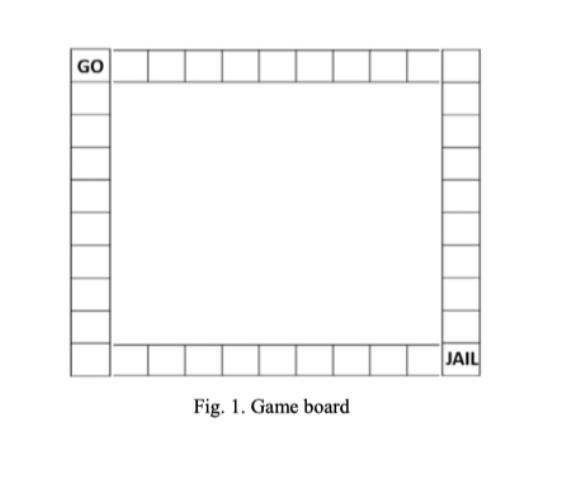

Monopoly Game Rules

You are asked to program a game called Monopoly in C++. This game is played by two players (you and computer in this assignment). The game and its rules are described as the follows.

To play this game, every player must set up an account first with positive balance say the starting deposit is 5000. This means that you have to set up a data base (a file) which records the players' information, for example, name, gender and account balance etc. and the program is supposed to be able to track the balance changes as the game is going.

This game is played on a game board as shown in Fig. 1.

This game board consists of 38 squares. Each square has a price tag (this price may be generated randomly within a price range say from 10 to 300) for the ownership except for the left top corner square which is the starting square ("GO" square, each game starts from here). Each player's account balance will be increased by 200 for each time the player passes this square (the "GO" square).

You and the computer take turns to roll a dice. The outcome of each rolling (a random number within the range of 1 to 6) decides how many squares you/ computer can advance in a clockwise direction on the board. After you have landed on a square:

    if this square is unoccupied (so this means each square except "GO" and "JAIL" has an ownership attribute): you can decide whether or not you should buy it;
    if this square is occupied by you (you've already bought it), then nothing needs to be done;
    if this square is occupied by your opponent and the adjacent squares are unoccupied or occupied by you: you will be fined by 10% of the square price;
    if this square and one of its adjacent squares are both occupied by your opponent (which means you opponent has purchased 2 consecutives squares): you will be fined by 20% of the square price;
    The fine is topped at 20% of the square price even if more than 2 consecutive squares have been occupied by your opponent.

The fine for each square can be further increased by 5% if the owner decides to invest on the square he/she has just bought off. The size of investment is half of the square price (which means the owner needs to pay 1.5xprice to buy and invest the square).

If the player lands on the "JAIL" square (the right bottom square), he/she needs to wait for a round before continue moving; The game ends when either one of the players declares bankruptcy (the balance <=0) or you have chosen to quit the game.

You should design and implement at least 3 classes (objects).
